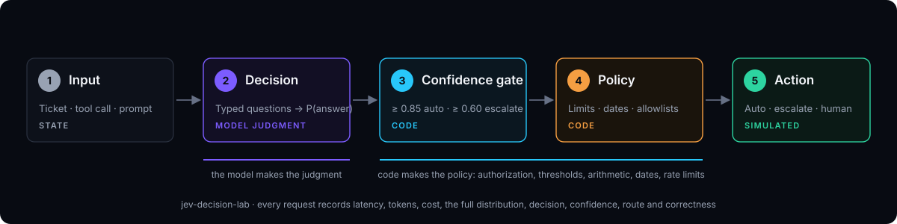

# jev-decision-lab

A small engineering lab for one question: **where does a decision model fit between deterministic code and general-purpose LLMs?**

Four interactive experiments, a benchmark runner and a calibration analysis. Every request records latency, tokens, cost, the full probability distribution, the decision, the confidence, the route the gate took and correctness against labelled data. Not a product, not a chatbot.



The model answers semantic questions. Code owns authorization, thresholds, arithmetic, dates, rate limits and execution. The gate is only legitimate if the model's confidence is calibrated, so there is an experiment for that too.

## Quick start

```bash
npm install
cp .env.example .env.local     # add TYPESAFE_API_KEY, or skip it
npm run dev                    # http://localhost:3000
```

No key? The built-in `mock` provider (keyword heuristics, deliberately mediocre, not a model) runs everything offline so you can learn the shape first.

```bash
npm run bench -- --provider mock,jev    # datasets through each provider, JSON + CSV in results/
npm run calibration                     # reliability tables, ECE, Brier
npm run cost                            # $ per decision, $ per 1M decisions
npm run latency -- --provider jev       # percentiles, batched vs sequential
```

## Experiments

| # | Experiment | Model decides | Code decides |
|---|---|---|---|
| 1 | Support Pipeline | department, refund requested, frustration | eligibility, $ limit, date window, escalation, confidence gate |
| 2 | Agent Firewall | intent alignment, blast radius | allowlist, role, arguments, rate limit, per-risk thresholds. Nothing executes. |
| 3 | Model Router | complexity, domain, needs tools | tier mapping, cost/latency budget, no silent downgrade |
| 4 | Calibration Lab | none | buckets every prediction by confidence and checks whether 0.8 means 80% |

## Providers

One interface, swap by env var: TypeSafe Jev direct, Jev via OpenRouter or Vercel AI Gateway, and OpenAI / Anthropic / Gemini asked to answer the same typed questions as JSON (the fair LLM comparison). See `.env.example`.

## Read more

- [Deep dive](docs/deep-dive.md): what Jev is, what each experiment teaches, what gets recorded, how to read calibration
- [Architecture](docs/architecture.md): layers, the decision contract, the policy engine, results on disk
- [Jev primitives](docs/jev-primitives.md): `choice`, `score`, `noul`, wire format, patterns
- [Experiments guide](docs/experiments.md): which examples to try and what to look for
- [CLAUDE.md](CLAUDE.md): design principles for anyone (human or AI) changing the code

## Safety

The Agent Action Firewall never executes anything. All tools are simulated (`lib/simulated-tools.ts`).

MIT. Teach with it, fork it, break it.
